# Calculator Master

**Calculator Master :: Debug Dungeon** — a menu-driven, RPG-style Python calculator.

## Student Information

- **Student Name:** Aerrol John Jimenez
- **Course and Section:** S-ITNT415 | BIT42
- **GitHub Username:** AerrolJJJ
- **Project:** Midterm Summative Assessment

## Project Description

Calculator Master is a menu-driven Python calculator developed using Git and GitHub
branching, Pull Requests, and merge operations. It runs in the terminal and keeps showing
the menu until the user chooses to exit.

To make it more fun, the calculator has a "Debug Dungeon" theme: the user plays as an
IT-student hero, every calculation is a "skill", and each successful calculation gives XP
that levels the hero up (Intern → Junior Dev → Mid Dev → Senior Dev → Calculator Master).
Every screen is drawn inside a bordered box.

## Branch Structure

| Branch | Purpose |
|---|---|
| `main` | Stable branch. Holds the calculator skeleton and receives every merged feature. |
| `addition_Jimenez` | Addition feature (+) |
| `subtraction_Jimenez` | Subtraction feature (-) |
| `multiplication_Jimenez` | Multiplication feature (x) |
| `division_Jimenez` | Division feature (/) with division-by-zero handling |

```
main
 ├── addition_Jimenez
 ├── subtraction_Jimenez
 ├── multiplication_Jimenez
 └── division_Jimenez
```

## Program Features

- **Addition** — adds 2 to 10 numbers
- **Subtraction** — subtracts the second number from the first
- **Multiplication** — multiplies two numbers
- **Division** — divides the first number by the second
- **Input validation** — number prompts only accept real, finite numbers
- **Invalid input handling** — empty input, letters, `nan`/`inf` and out-of-range values are
  rejected with an error message and the program asks again
- **Invalid menu handling** — an unknown menu choice shows an `ERROR 404: SKILL NOT FOUND` box
- **Division-by-zero handling** — dividing by zero shows an error box instead of crashing
- **Continuous execution** — the menu keeps coming back after every operation
- **Exit option** — choose `0` to log out and see the final hero stats
- Extras: hero name, XP bar and levels, and a battle log of every calculation

## How to Run

Requires Python 3 (tested with Python 3.8 on Linux and 3.12 on Windows).

```
python3 calculator_master.py      # Linux / macOS
python calculator_master.py       # Windows
```

## Git Workflow

1. `main` was created first with the calculator skeleton (menu, borders, input validation,
   and a "locked" message for operations that were not built yet) and pushed to GitHub.
2. Each calculator operation was developed on its own feature branch, created from the
   updated `main`.
3. The changes were committed on the feature branch and pushed to GitHub.
4. A Pull Request was opened from the feature branch into `main` and reviewed.
5. After approval, the Pull Request was merged into `main` with a merge commit, and the next
   feature branch was started from the updated `main`.

## Commit History

Each feature branch contains at least two meaningful commits: one that implements the
operation and one that improves its validation, error handling, or output. The Pull Requests
were merged with merge commits, so every feature commit is still visible in the history of `main`.

## Pull Requests

| PR | Branch → Base | Title | Commits | Review | Status |
|---|---|---|---|---|---|
| [#1](../../pull/1) | `addition_Jimenez` → `main` | Add addition feature (addition_Jimenez) | 2 | Approved by KiyoTopKop | Merged |
| [#2](../../pull/2) | `subtraction_Jimenez` → `main` | Add subtraction feature (subtraction_Jimenez) | 2 | Approved by KiyoTopKop | Merged |
| [#3](../../pull/3) | `multiplication_Jimenez` → `main` | Add multiplication feature (multiplication_Jimenez) | 2 | Approved by KiyoTopKop | Merged |
| [#4](../../pull/4) | `division_Jimenez` → `main` | Add division feature with division-by-zero handling (division_Jimenez) | 2 | Approved by KiyoTopKop | Merged |

All feature branches were kept after merging.

## Sample Execution

The final calculator was run from the `main` branch after all four Pull Requests were merged.

### Final calculator (main menu)
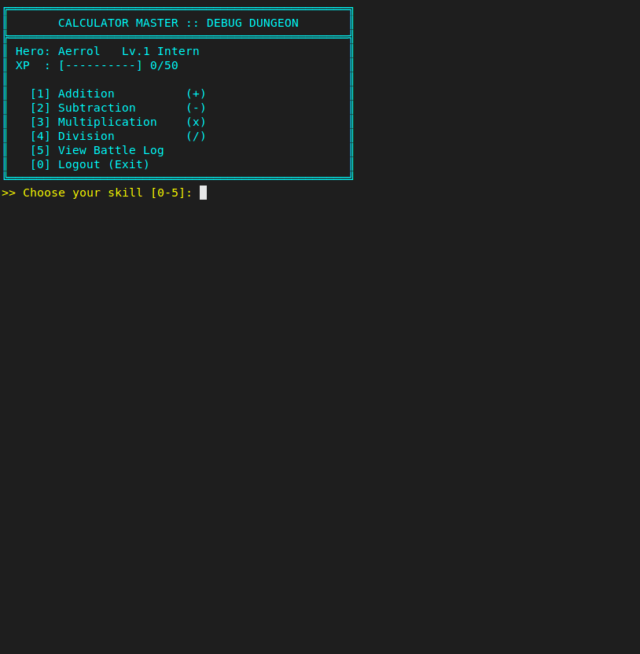

### Calculator operations (battle log after +, -, x, /)
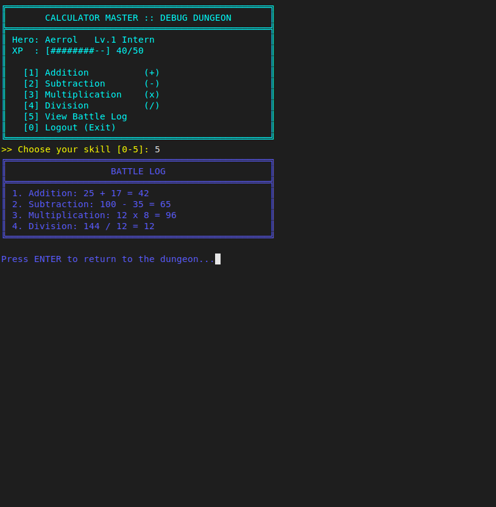

| Addition | Subtraction |
|---|---|
| 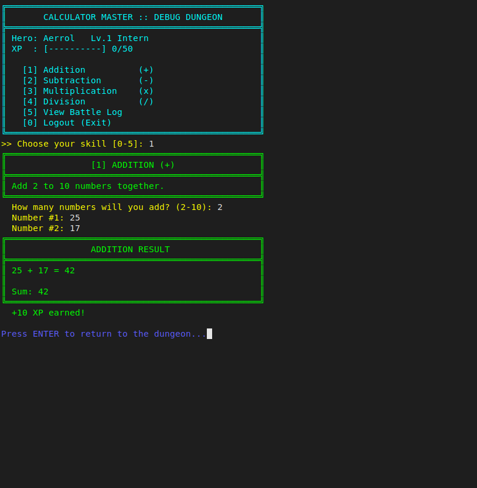 | 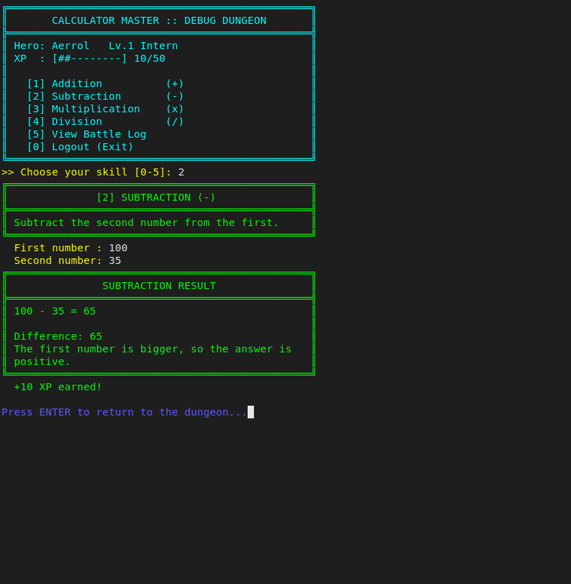 |
| **Multiplication** | **Division** |
| 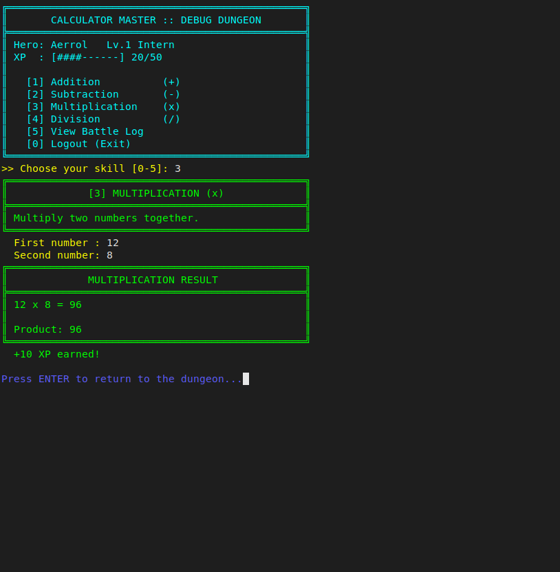 | 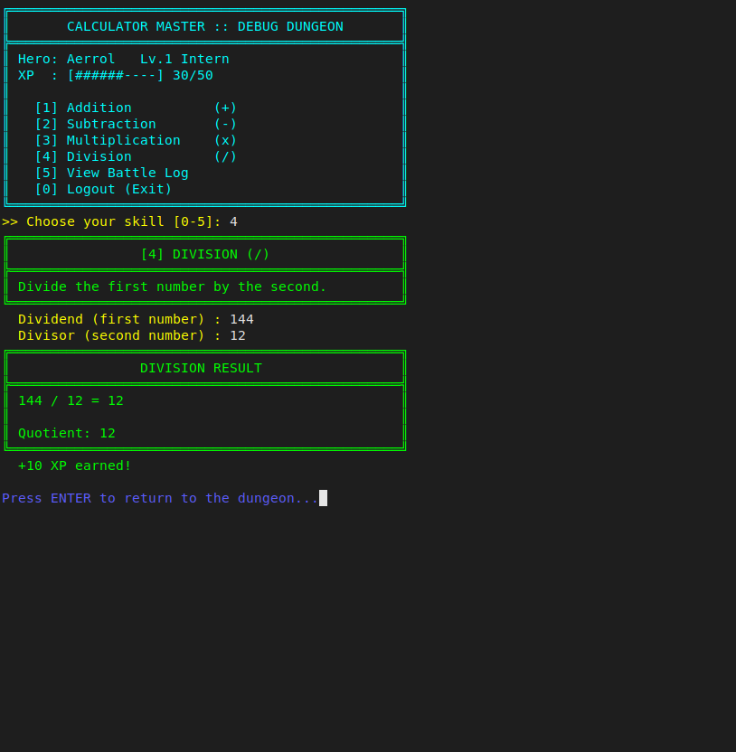 |

### Invalid menu input
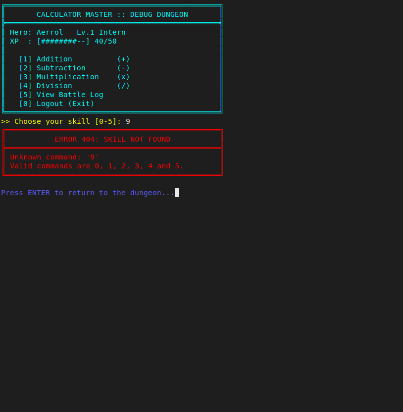

### Invalid number input
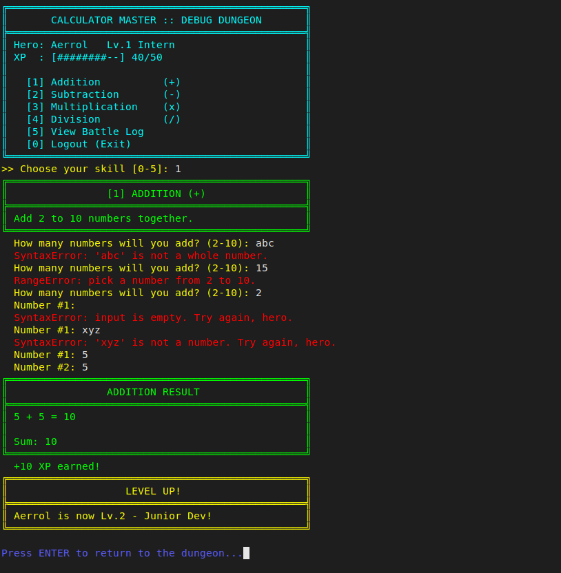

### Division by zero
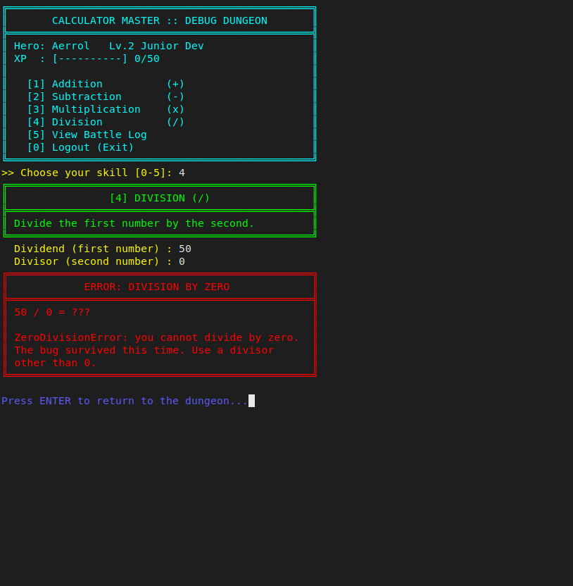

The program does not crash and returns to the menu:

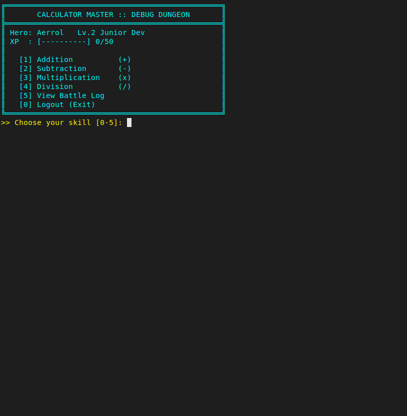

### Exit
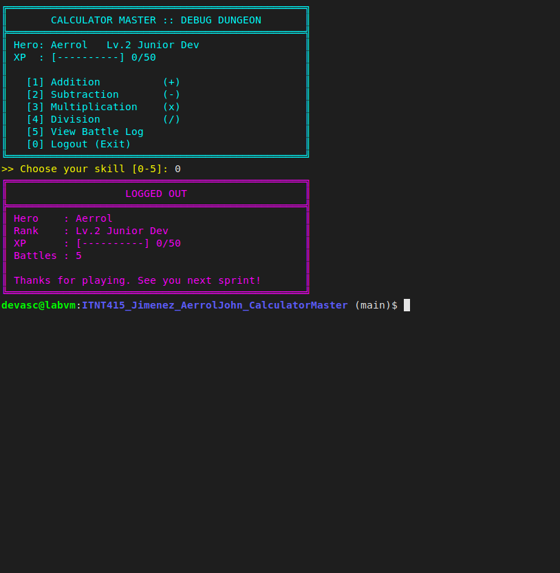

## GitHub Evidence

| Evidence | Screenshot |
|---|---|
| All branches | [01_all_branches.png](screenshots/01_all_branches.png) |
| Commit history | [05_commit_history.png](screenshots/05_commit_history.png), [05b_commit_history_full.png](screenshots/05b_commit_history_full.png) |
| Pull Requests (all approved and merged) | [06_pull_requests.png](screenshots/06_pull_requests.png) |
| Merged PR #1 (approval + merge) | [07_merged_pull_requests.png](screenshots/07_merged_pull_requests.png) |
| Merged PR #2 / #3 / #4 | [07b_merged_pr2.png](screenshots/07b_merged_pr2.png), [07c_merged_pr3.png](screenshots/07c_merged_pr3.png), [07d_merged_pr4.png](screenshots/07d_merged_pr4.png) |
| `git status`, `git branch -a`, `git remote -v`, `git log --graph` | [09_git_verification.png](screenshots/09_git_verification.png) |

### Step-by-step workflow screenshots

Taken in the terminal and browser while the work was being done (`screenshots/workflow/`):

| Step | Screenshots |
|---|---|
| Create repository and push `main` | [wf01](screenshots/workflow/wf01_create_repo_and_push_main.png), [wf02](screenshots/workflow/wf02_repo_created_github.png) |
| Addition: branch, commit 1, commit 2, push, PR, approval, merge, pull | [wf03](screenshots/workflow/wf03_addition_create_branch.png), [wf04](screenshots/workflow/wf04_addition_commit1.png), [wf05](screenshots/workflow/wf05_addition_commit2.png), [wf06](screenshots/workflow/wf06_addition_push.png), [wf07](screenshots/workflow/wf07_addition_pr_created.png), [wf08](screenshots/workflow/wf08_addition_pr_approved.png), [wf09](screenshots/workflow/wf09_addition_pr_merge.png), [wf10](screenshots/workflow/wf10_addition_pull_main.png) |
| Subtraction: branch, commit 1, commit 2, push, PR, approval, merge, pull | [wf21](screenshots/workflow/wf21_subtraction_create_branch.png), [wf22](screenshots/workflow/wf22_subtraction_commit1.png), [wf23](screenshots/workflow/wf23_subtraction_commit2.png), [wf24](screenshots/workflow/wf24_subtraction_push.png), [wf25](screenshots/workflow/wf25_subtraction_pr_created.png), [wf26](screenshots/workflow/wf26_subtraction_pr_approved.png), [wf27](screenshots/workflow/wf27_subtraction_pr_merge.png), [wf28](screenshots/workflow/wf28_subtraction_pull_main.png) |
| Multiplication: branch, commit 1, commit 2, push, PR, approval, merge, pull | [wf31](screenshots/workflow/wf31_multiplication_create_branch.png), [wf32](screenshots/workflow/wf32_multiplication_commit1.png), [wf33](screenshots/workflow/wf33_multiplication_commit2.png), [wf34](screenshots/workflow/wf34_multiplication_push.png), [wf35](screenshots/workflow/wf35_multiplication_pr_created.png), [wf36](screenshots/workflow/wf36_multiplication_pr_approved.png), [wf37](screenshots/workflow/wf37_multiplication_pr_merge.png), [wf38](screenshots/workflow/wf38_multiplication_pull_main.png) |
| Division: branch, commit 1, commit 2, push, PR, approval, merge, pull | [wf41](screenshots/workflow/wf41_division_create_branch.png), [wf42](screenshots/workflow/wf42_division_commit1.png), [wf43](screenshots/workflow/wf43_division_commit2.png), [wf44](screenshots/workflow/wf44_division_push.png), [wf45](screenshots/workflow/wf45_division_pr_created.png), [wf46](screenshots/workflow/wf46_division_pr_approved.png), [wf47](screenshots/workflow/wf47_division_pr_merge.png), [wf48](screenshots/workflow/wf48_division_pull_main.png) |
